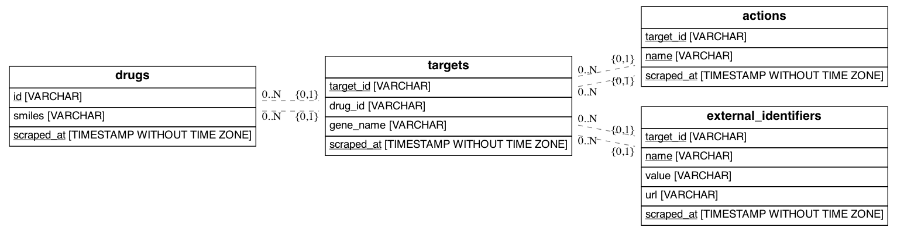

# Drugbank Scraper

## Run

This repo uses `Python 3.8.5`.

1. See [Pipenv & Virtual Environments](https://docs.python-guide.org/dev/virtualenvs/) guide to create a virtual environment and activate the virtual environment
1. Install requirements with `pip install -r requirements.txt`.
1. Create PostgreSQL database.
1. Create .env file with `cp .env.template .env` and fill environment variables.

## Spiders

### Drug

Run `scrapy crawl drug` to run drug spider and populate database. This will scrape data, create and populate database tables. Final data will be in `drugbank` schema. This will:

1. Scrape following data:
    * DrugBank ID
    * SMILES string
    * Gene name
    * Actions and alternative identifiers of every target.
2. Save scraped data into the previously created PostgreSQL database.

## Development

1. See the virtual environment step above.
1. Install requirements with `pip install -r requirements-dev.txt`.
1. Run `pre-commit install` to install pre-commit hooks. This repo is already set up to use some pre-commit hooks for code quality purposes. Configuration file is available [here](.pre-commit-config.yaml). More information about pre-commit is available on [their website](https://pre-commit.com/).
